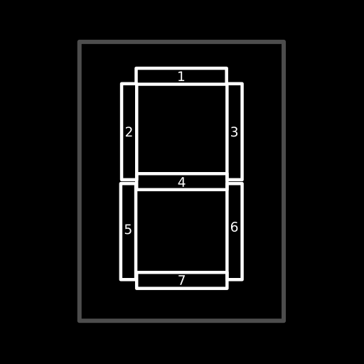
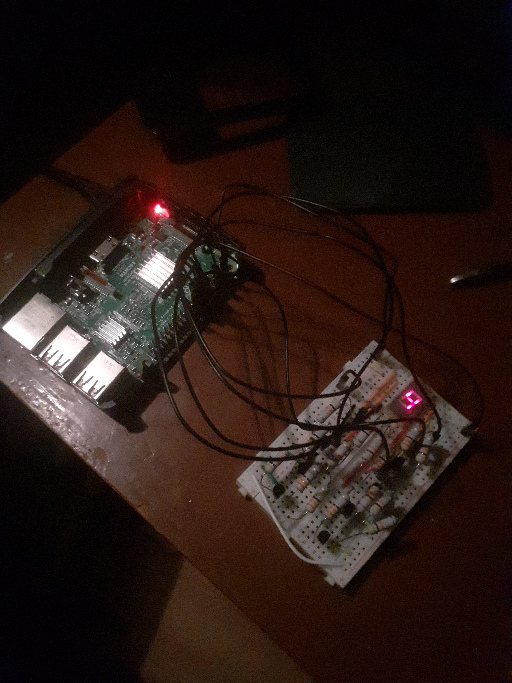

# Raspberry Pi LED Display Controller
Control one LED segment display with your Raspberry Pi using any integrated circuits.  

- [Installation](#installation)
- [Usage](#usage)
- [Supported characters](#supported-characters)

# Why?
It's one of my RPi practise projects. It has very limited use, and it's better to use an integrated circuit where possible.

# How does it work?
The project's premise is simple - it allows you to display alphanumeric characters on a single segment display.  
It uses one GPIO pin per segment, requiring total of 7 free pins (command/dot are **not** supported).  
The code contains a registry of supported characters, each assigned a set of pins required to display the character.  

# Installation
## Maven
Add the following to `dependencies` section in your `pom.xml`.  
Replace `{latest version}` with the latest version shown below.
```xml
<dependency>
    <groupId>io.github.defective4.rpi</groupId>
	<artifactId>rpi-display-controller</artifactId>
	<version>{latest version}</version>
</dependency>
```
*Latest Maven version*  


# Usage
Example code can be found [here](src/main/java/DisplayMain.java).  

## Mapping GPIO pins to `DisplayController`'s constructor
```java
new DisplayController(context, /** 7 GPIO pin addresses, each connected to a display segment **/);
```   


## Board example

  
*An example board.*  
*Each segment is powered by a NPN transistor, each with its base connected to the corresponding GPIO pin.*  
*The display on the photo is an old Russian LED display with a common anode.*

# Supported characters
An always up-to-date list of supported chars can be found in [DisplayCharacter.java](src/main/java/io/github/defective4/rpi/DisplayCharacter.java).  
Supported characters include:
- All numbers from 0 to 9 inclusive
- Letters <kbd>A</kbd>, <kbd>C</kbd>, <kbd>c</kbd>, <kbd>E</kbd>, <kbd>F</kbd>, <kbd>H</kbd>, <kbd>h</kbd>, <kbd>J</kbd>, <kbd>L</kbd>, <kbd>o</kbd>, <kbd>P</kbd>, <kbd>U</kbd>, <kbd>u</kbd>